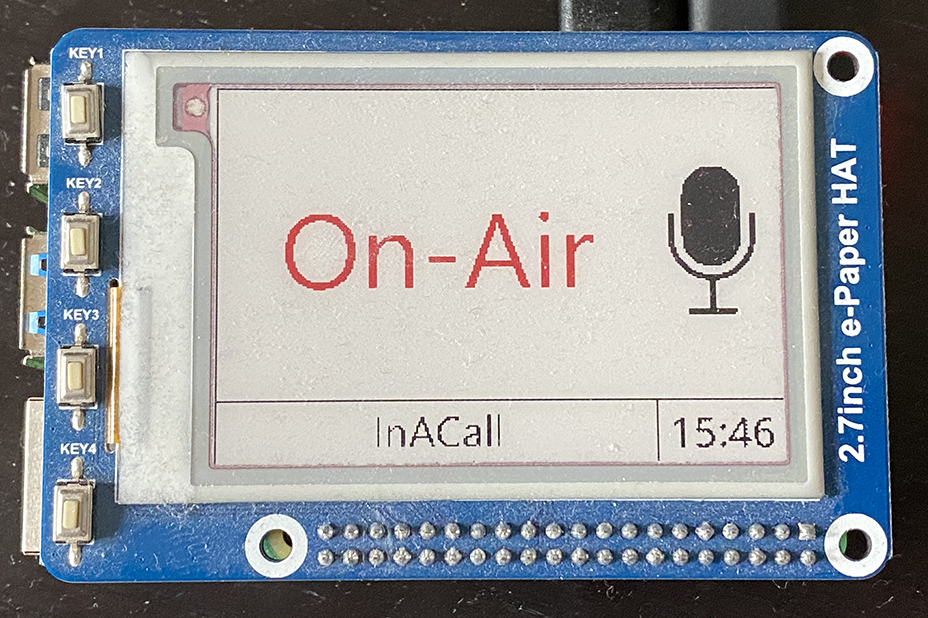

# ePaperTeamsSign
Using a rapsberry pi with a 2.7inch e-Paper HAT to display the current presence status.

Features

* Use Microsoft Graph API to receive Temas presence updates
* Tri-color rendering for e-Paper HAT display
* Display server on Raspberry PI

# Architecture
The application is split into a desktop and raspberry pi part, mainly due to support tightened security constraints (e.g. the device receiving the updates needs to be corp managed).
The desktop renders the output and uses the raspberry pi as an external display.

# Desktop

Edit the [App.config](ePaperTeamsPresence.Desktop/ePaperTeamsPresence.Desktop/App.config) and run the [Visual Studio Solution](ePaperTeamsPresence.Desktop/ePaperTeamsPresence.Desktop.sln).

# Raspberry Pi
The display server accepts:

* 1x BMP for black pixels
* 1x BMP for red pixels
* 1x template JSON to designate pixel coordinates to render local information (time, temperature, humidity,...)

Clone the repo and run 

```
cd ePaperTeamsPresence.Pi
flask run --host=0.0.0.0
```

